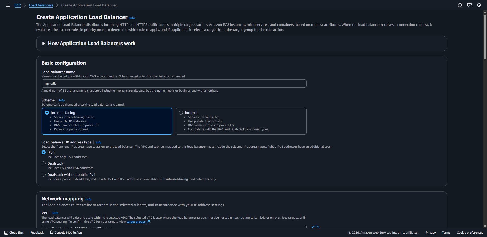
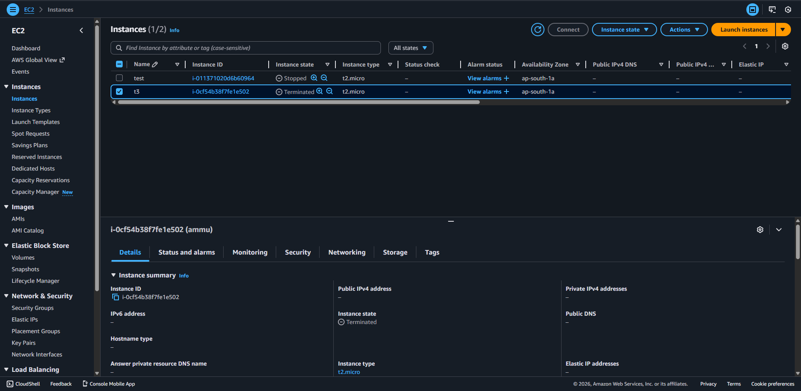
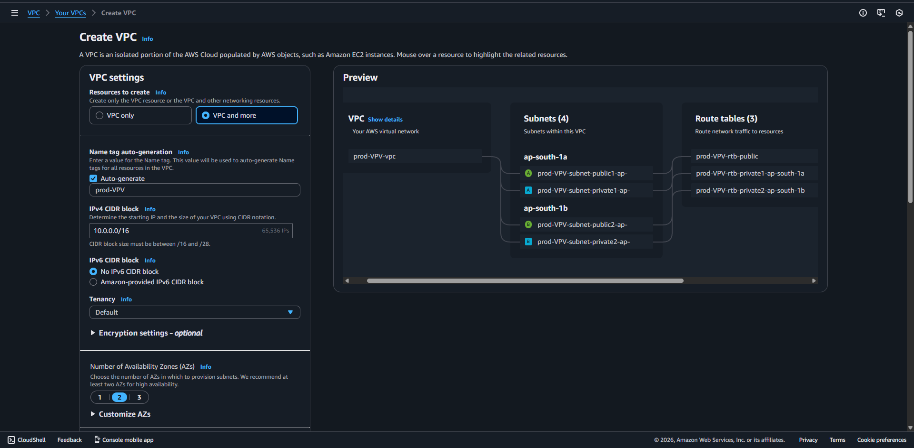
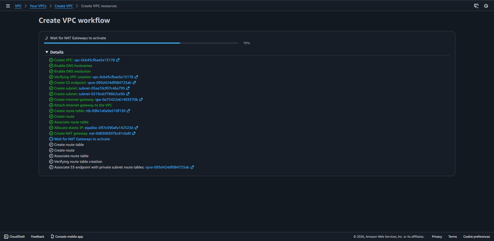
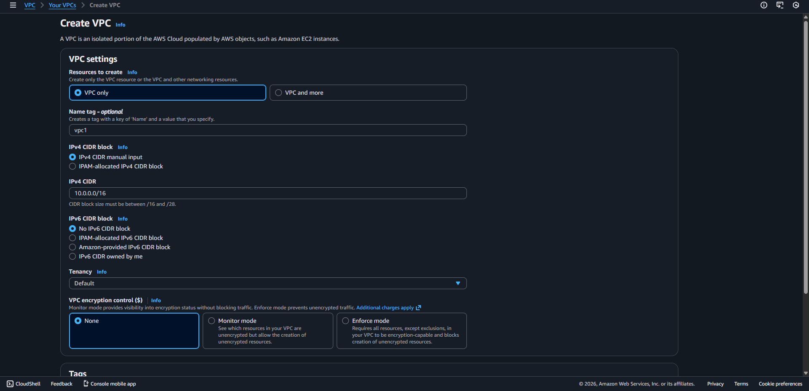

# 🚀 Production-Grade 3-Tier Architecture on AWS (Multi-AZ)

## 📌 Project Overview

This project demonstrates a **Highly Available 3-Tier Architecture**
deployed across **2 Availability Zones (Multi-AZ)** using AWS.

It simulates how real-world companies deploy secure, scalable, and
production-ready web applications.

------------------------------------------------------------------------

# 🏗 Architecture Diagram (Conceptual)

                    🌍 Internet
                         |
                         v
            ┌──────────────────────────┐
            |  Application Load Balancer|
            |   (Public Subnets - 2 AZ) |
            └──────────────────────────┘
                     |           |
                     v           v
            ┌────────────┐ ┌────────────┐
            |   EC2 App  | |   EC2 App  |
            | (Private AZ1)| (Private AZ2)|
            └────────────┘ └────────────┘
                     \           /
                      \         /
                       v       v
                  ┌────────────────┐
                  |   RDS MySQL    |
                  |  (Private Multi-AZ) |
                  └────────────────┘

    Private EC2 instances access the Internet via:
    NAT Gateway (Public Subnet) → Internet Gateway

------------------------------------------------------------------------

# 🧱 Architecture Components

## 🌐 VPC (Virtual Private Cloud)

-   CIDR Block: 10.0.0.0/16
-   2 Public Subnets (ap-south-1a, ap-south-1b)
-   2 Private Subnets (ap-south-1a, ap-south-1b)
-   Internet Gateway
-   Route Tables (Public & Private)
-   NAT Gateway (Single for cost optimization)

------------------------------------------------------------------------

## ⚖ Application Load Balancer (ALB)

-   Deployed in 2 public subnets
-   Distributes traffic across EC2 instances
-   Performs health checks
-   Provides High Availability

------------------------------------------------------------------------

## 💻 EC2 (Application Layer)

-   Launched in Private Subnets
-   No public IP assigned
-   Receives traffic only from ALB
-   Uses NAT Gateway for outbound internet access

------------------------------------------------------------------------

## 🗄 RDS MySQL (Private - Multi-AZ)

-   Hosted in Private Subnets
-   Multi-AZ enabled for failover
-   Not publicly accessible
-   Accessible only via EC2 Security Group

------------------------------------------------------------------------

## 🌍 NAT Gateway

-   Placed in Public Subnet
-   Attached with Elastic IP
-   Allows private EC2 to access internet
-   Blocks inbound public traffic

------------------------------------------------------------------------

# 🔐 Security Groups

## 1️⃣ ALB-SG

Inbound: - HTTP (80) → 0.0.0.0/0

## 2️⃣ EC2-SG

Inbound: - HTTP (80) → ALB-SG - SSH (22) → Your Public IP

## 3️⃣ RDS-SG

Inbound: - MySQL (3306) → EC2-SG

------------------------------------------------------------------------

# 🛠 VPC Wizard vs Manual Setup

## VPC Wizard

 
 
 

### Advantages

-   Fast setup
-   Beginner friendly
-   Reduces configuration errors

### Best For

-   Learning
-   Demo projects
-   Quick setups

------------------------------------------------------------------------

## Manual Setup

### Advantages

-   Full control
-   Better networking understanding
-   Production-level customization

### Best For

-   Cloud Engineer preparation
-   Enterprise environments
-   Interview readiness

------------------------------------------------------------------------

# 🌍 Why Multi-AZ?

-   High Availability
-   Fault Tolerance
-   Automatic Failover (RDS)
-   Required for Production-level deployments

------------------------------------------------------------------------

# 💰 Estimated Cost (Short Testing - Approx 5 Hours)

  Service                  Approx Cost
  ------------------------ ---------------------
  EC2 (t2.micro)           \~\$0.06
  NAT Gateway              \~\$0.25
  RDS (db.t3.micro)        \~\$0.10
  ALB                      \~\$0.12
  Elastic IP (if unused)   Small hourly charge

⚠ NAT Gateway is the main cost driver.

------------------------------------------------------------------------

# 🛑 Cleanup After Project Completion

To avoid charges, delete:

1.  Load Balancer
2.  Target Groups
3.  Auto Scaling Group
4.  EC2 Instances
5.  RDS Database
6.  NAT Gateway
7.  Release Elastic IP
8.  Delete VPC (after all dependencies removed)

------------------------------------------------------------------------

# 🧠 What This Project Proves

-   Strong understanding of AWS networking
-   Secure architecture design
-   Multi-AZ high availability implementation
-   Production-ready infrastructure deployment
-   Cost awareness and resource cleanup discipline

------------------------------------------------------------------------
